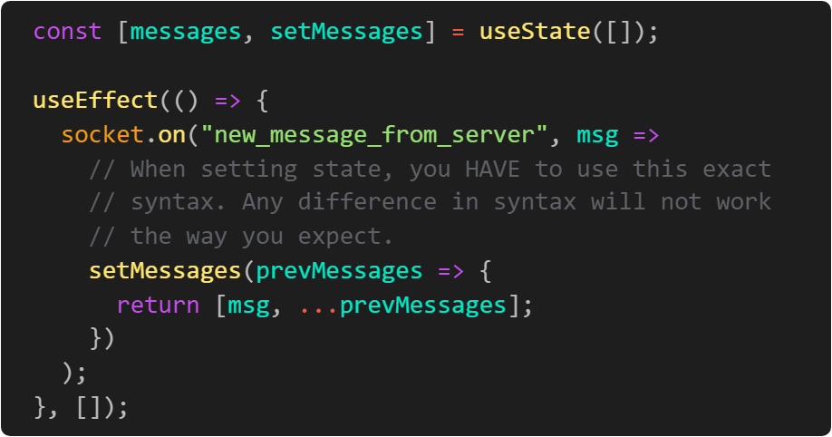

# Web Sockets

The WebSocket API is an advanced technology that makes it possible to open a two-way interactive communication session between the user's browser and a server. With this API, you can send messages to a server and receive event-driven responses without having to poll the server for a reply.

To help understand what a web socket is, we first need to be present to how HTTP works in the first place. Let's remove web sockets from the picture for a minute and consider an example where we are tasked with a basic chat application. There are a lot of things to consider when building a chat application from scratch (how do we want to style everything, do we want to show the list of connected users, do we want multiple chat rooms, etc...?) however, consider that for the best user experience we want messages to be displayed immediately as they are sent to all the connected clients in real-time. To accomplish this without web sockets we would have to design a function to query the database and run at an interval, say 500 milliseconds, to create the real-time effect. Below is a simple illustration showing the HTTP request/response cycle of our chat application:


Consider if this application has 300+ clients connected at one time and each client is pinging the server every 500ms checking if there is a message. This would be very inefficient and will likely result in latency issues.


Web sockets were designed to help solve this dilemma of creating a real-time environment without pinging the server every 500ms. Web sockets work by generating an "agreement" so to speak. This "agreement" is called a handshake. Once the handshake is complete, both the client and the server can send data to each other without making another HTTP request. 

Our new HTTP request/response cycle with Web Sockets:


One request from the client asks the server to watch for any and all messages sent from other clients. If a message is sent to the server, the server will send down that message to all connected clients without the need for the client to make another HTTP request.

# The Big Picture
A good way to visualize the client/server interaction with sockets is a tennis match. When one side sends a message, or emits an event, it's like one player has hit the ball to the other side of the court. Then, depending on the type of message, the receiving side may decide to send a message in response back to the sender, or hit the ball to the other side of the court. It's this ongoing back and forth communication that makes sockets such a powerful technology.


# On the Server

With Node.js, there is a package called Socket.io. Socket.io utilizes everything in the Web Sockets API and then adds some additional features on top of that. This makes things simple enough for us because we already use Node.js for our back end, we can simply use socket.io without any issues. Socket.io is an install-able npm package that we install using the same installation method we use to install express and/or mongoose:

```
npm install socket.io
```

In order to use socket.io, we need to pass it an instance of our server. To do that, we just need to pass our server variable like this:

```js
// server.js
const express = require('express');
const app = express();
 
const server = app.listen(8000, () =>
  console.log('The server is all fired up on port 8000')
);
 
// To initialize the socket, we need to
// invoke the socket.io library
// and pass it our Express server
const io = require('socket.io')(server, { cors: true });
```

Once initialized, we can now set event listeners and event emitters to help pass data along between the server and client. There is one event listener, named "connection", that is required that we must have before we can create our own event listeners. Here is what that looks like:


At this point, inside the function we can now use the socket to create event listeners and emitters like so:

socket.on will listen for an event from the client. It takes a callback function that contains the data from the client. We then send that data straight to all the other clients.

## Emitting Events from the Server
With sockets, the individual clients don't communicate directly with one another; instead all communications must pass through the server. There are multiple ways for the server to emit events to connected clients, depending on which clients you intend to reach. They are all functions and all three take in two arguments: 1) the event name, and 2) optionally any data you want to send along with the event.

* io.emit emits an event to all connected clients
* socket.broadcast.emit emits an event to all clients other than this * particular one, referenced by the socket variable
* socket.emit emits an event directly to this specific client


# On the Client
With React, we need to install socket.io-client.

npm install socket.io-clientcopy
To use sockets in React, we need to add an import statement to the top of our component file.

```js 
import io from 'socket.io-client';
```

To initialize the socket, we need to invoke React's useState hook and pass a callback function which will invoke the imported io function like so: io(":nodeServerPortNumberGoesRightHere") . The reason we have to pass in a callback is that if we were to directly invoke the io function, it would be called every time the component rerenders, meaning that we would be creating a bunch of extra sockets. Additionally, we need to add our event listeners inside of a React useEffect callback to ensure that they only get added when the component loads.

A super quick and simple setup will look like this:

```js 
import React, { useState, useEffect } from 'react';
import io from 'socket.io-client';
import './App.css';
 
function App() {
  // notice that we pass a callback function to initialize the socket
  // we don't need to destructure the 'setSocket' function since we won't be updating the socket state
  const [socket] = useState(() => io(':8000'));
 
  useEffect(() => {
    // we need to set up all of our event listeners
    // in the useEffect callback function
    console.log('Is this running?');
    socket.on('Welcome', data => console.log(data));
 
    // note that we're returning a callback function
    // this ensures that the underlying socket will be closed if App is unmounted
    // this would be more critical if we were creating the socket in a subcomponent
    return () => socket.disconnect(true);
  }, []);
 
  return (
    <div className="App">
      <h1>Socket Test</h1>
    </div>
  );
}
 
export default App;
```

Note: If your app is creating two socket connections every time you load the client side, it's probably related to the fact that create-react-app now wraps the App component in a React.StrictMode component to help detect issues in development. Unfortunately, this causes the lazy initial state callback to be fired twice. To prevent this, simply remove the wrapping component in index.js. See the following issue on GitHub: https://github.com/facebook/react/issues/15074

Further Reading:
<a href="https://reactjs.org/docs/hooks-reference.html#lazy-initial-state"> Lazy Initial State</a>
<a href="https://reactjs.org/docs/hooks-reference.html#cleaning-up-an-effect">Cleaning up an effect</a>


# Chat app

Classic Chat App
Building off of the previous assignment, your task is to create a fully functional chat application. Have your cohort mates help test your application throughout your development process.

There is ONE unspoken, not found on the internet, hard to fix, not straightforward bug when building your chat app.

On the client, when you are setting state inside of an event listener, you will need to set state in a very, very specific way. Below is what you need to know. When you call your "setter" function, instead of passing it the new value, you need to pass it a callback function that will compute the new value based on the existing value. See the diagram below for an example.

